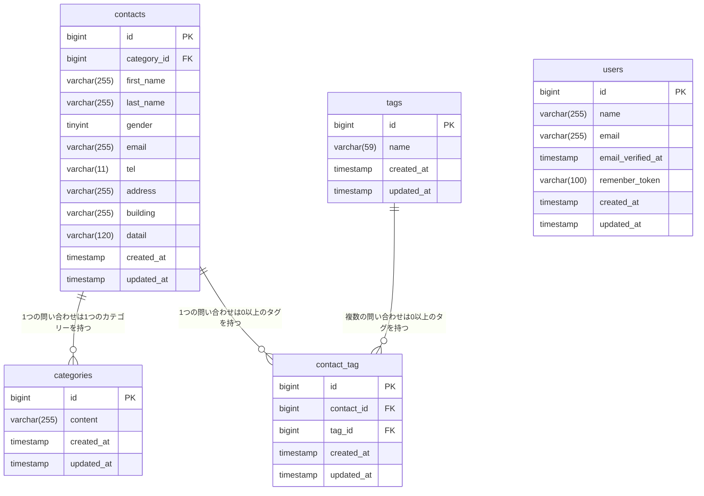

# 確認テスト README.md

## A.プロジェクト名
新お問い合わせフォーム

### 開発者
森　太

## B.概要

### 目的
確認テストとして、「新お問い合わせフォーム」の仕様書が提供されたので、仕様書を基に以下の機能を実装しました。<br>
**なお、bladeファイルは仕様書と共に提供されました。**

- お問い合わせ入力フォーム<br>
　 http://localhost で表示。<br>
　 日本語の姓名順になるように提供bladeファイルを修正。
- お問い合わせ内容確認フォーム<br>
　 入力フォームの確認画面ボタンで表示。<br>
　 送信ボタンの押下でContactsテーブルに保存。<br>
　 日本語の姓名順になるように提供bladeファイルを修正。
- サンクスフォーム<br>
　 テーブル保存後サンクスフォームに移行。<br>
　 HOMEボタンで入力フォームの初期画面に戻る。
- 管理画面<br>
　 http://localhost/admin で表示。<br>
　 登録済みのお問い合わせ内容を一覧表示。7件/ページで表示。<br>
　 名前、メールアドレス、お問い合わせカテゴリ、日付で検索し、<br>
　 検索条件にマッチしたテーブル内容を再表示。<BR>
　 表示行にある詳細ボタンで塞画面を表示。<BR>
　 日本語の姓名順になるようにbladeファイルを修正。
- お問い合わせ詳細フォーム<br>
　 選択したお問い合わせ情報を表示。<br>
　 フォーム内の削除ボタンでお問い合わせ情報をテーブルから削除。<br>
　 日本語の姓名順になるようにbladeファイルを修正。
- タグ編集ページ<br>
　 管理画面の下半分に配置。<br>
　 tagsテーブルの内容を一覧表示、<br>
　 入力ボックスで入力した文字列を新規タグとしてテーブルに登録。<br>
　 編集ボタンを押すとタグ編集画面を表示。<br>
　 削除ボタンで該当タグを削除。
- ログイン画面<br>
　 http://localhodt/login で表示。<br>
　 ログインボタンで管理画面を表示。
- 管理者登録画面<br>
　 http://localhodt/register で表示。<br>
　 登録ボタンで管理者ユーザ情報をusersテーブルに保存。

## C.ＥＲ図



## D.環境構築手順
<br>
新お問い合わせフォームを制作するための開発環境をセットアップします。<br>
以下の環境は事前に準備されているものとします。<br>
- Docker Desktop: Dockerを実行するためのツール<br>
- Git、GitHub: バージョン管理システム<br>
- テキストエディタ: VS Code推奨<br>
<br>

### Step0:ホームディレクトリに移動
ご自分の環境に合わせて、ホームディレクトリに移動します。<br>
この配下に開発環境が展開されます。<br>
```
cd ~/coachtech
```

### Step1:Laravelプロジェクトの作成
以下のDockerコマンドを実行して、Laravel 10プロジェクトを作成します。<br>
```
docker run --rm \
    -u "$(id -u):$(id -g)" \
    -v "$(pwd):/var/www/html" \
    -w /var/www/html \
    -e COMPOSER_CACHE_DIR=/tmp/composer_cache \
    laravelsail/php82-composer:latest \
    composer create-project laravel/laravel:^10.0 contact-form-app
```
ホームディレクトリ配下に`contact-form-app`フォルダが作成されます。<br>
プロジェクトに必要なファイル群はこのフォルダ（プロジェクトフォルダ）内に格納されます。<br>
<br>

### Step2:Laravel Sailのインストール
プロジェクト作成後、プロジェクトフォルダ（`contact-form-app`）移動し、Laravel Sailをインストールします。<br>

```
# プロジェクトディレクトリに移動
cd contact-form-app

# Laravel Sailをインストール
docker run --rm \
    -u "$(id -u):$(id -g)" \
    -v "$(pwd):/var/www/html" \
    -w /var/www/html \
    -e COMPOSER_CACHE_DIR=/tmp/composer_cache \
    laravelsail/php82-composer:latest \
    composer require laravel/sail --dev

# Sailの設定ファイルをパブリッシュ（MySQLを選択）
docker run --rm \
    -u "$(id -u):$(id -g)" \
    -v "$(pwd):/var/www/html" \
    -w /var/www/html \
    -e COMPOSER_CACHE_DIR=/tmp/composer_cache \
    laravelsail/php82-composer:latest \
    php artisan sail:install --with=mysql
```

### Step3:フロントエンドのセットアップ

3-1. エイリアス登録
```
echo "alias sail='[ -f sail ] && bash sail || bash vendor/bin/sail'" >> ~/.zshrc 
```

3-2.Sailの起動
初回起動時はダウンロードと環境構築を行うため、数分時間がかかりまさす。
```
sail up -d
```

3-3.Tailwind CSSのインストール
提供されたbladeファイルが正しく動作するようにTailwond CSSをインストールします。<br>

```
# NPM依存パッケージのインストール
sail npm install

# Tailwindo CSSのインストール
sail npm install -D tailwindcss@^3.4.0 postcss autoprefixer

# 設定ファイルの生成
sail npx tailwindcss init -p
```

3-4.Tailwind CSSのテンプレートパス設定
VSCodeを使って、Tailwind CSSに関係するファイルを以下の内容に変更します。<br>

```

# VSCode起動
code .
```

- ファイル: `tailwind.config.js`

```php
/** @type {import('tailwindcss').Config} */
export default {
  content: [
    "./resources/**/*.blade.php",
    "./resources/**/*.js",
    "./resources/**/*.vue",
  ],
  theme: {
    extend: {},
  },
  plugins: [],
}
```

- ファイル: `resource/css/app.css`

```php
@tailwind base;
@tailwind components;
@tailwind utilities;
```

3-5. .envファイルとphpMyAdminの設定
開発中に使用するデータベース用ツールphpMyAdminを設定します。<br>
- `.env`ファイルの確認<br>
`.env`ファイルを開き、データベース説情報が以下と一致しているかを確認します。<br>
（開発環境構築直後は下記の通りになっています）<br>

ファイル: `.env`
```php
DB_CONNECTION=mysql
DB_HOST=mysql
DB_PORT=3306
DB_DATABASE=laravel
DB_USERNAME=sail
DB_PASSWORD=password
```

- ohoMyAdminの追加
`compose.yaml`を開き、`mysql`サービスの後に以下の設定を追加して保存します。<br>

ファイル: `compose.yaml`
```php
    phpmyadmin:
        image: 'phpmyadmin:latest'
        ports:
            - '${FORWARD_PHPMYADMIN_PORT:-8080}:80'
        environment:
            PMA_HOST: mysql
            PMA_USER: '${DB_USERNAME}'
            PMA_PASSWORD: '${DB_PASSWORD}'
        networks:
            - sail
        depends_on:
            - mysql
```

**注意：yamlファイルはインデントがずれると正しく動作しません。<br>
　　  `phpMyAdmin`のインデントをすでにある`mysql`と同じに揃えてください。**<br>

3-6.Sailの再起動と準備
- Sailの再起動
```
sail down
sail up -d
```

- アプリケーションキーの生成
```
sail artisan key:generate
```

### Step4:動作確認

4-1.Laravelの動作確認
ブラウザで`http://localhost`にアクセスし、Laravelのウェルカムページが表示されることを確認します。

4-2.phpMyAdminの動作確認
ブラウザで`http://localhost:8080`にアクセスし、phpMyAdminが表示されることを確認します。

4-3.マイグレーションの実行
```
sail artisan migrate
```
マイグレーション実行後、Laravelグループ配下に`users`テーブルなどが作成されていることを確認します。<br>

### Step5:Git/GitHub準備とIssue登録

5-1.リポジトリの作成
1. GitHubにログインする
2. 「New Repository」を選択
3. 以下の情報を入力する

<table>
<tr><th>項目</th><th>値</th></tr>
<tr><td>Repository name</td><td>Task manager</td></tr>
<tr><td>Description</td><td>タスク管理アプリ/td></tr>
<tr><td>PUblic / Private</td><td>Private</td></tr>
<tr><td>Initialie woth README　</td><td>チェックしない</td></tr>
</table>

5-2:Laravel Pintの準備
git commitで実際にコミットする前に自動でPintが実行されるように鉄製します。<br>
**注意！隠しフォルダである`.git`フォルダ内のファイルを操作します。

1. 隠しフォルダを表示（Macの場合`Shift+Commend+"."`)
2. `.git/Hook`フォルダに移動
3. `Pre-commit'ファイル（拡張子なし）を以下の内容で作成

```php
# .git/hooks/pre-commit
#!/bin/sh
./vendor/bin/pint --test
if [ $? -ne 0 ]; then
    echo "コードスタイルに問題があります。sail pint を実行してください。"
    exit 1
fi
```

4. 隠しフォルダ非表示に切り替える（Macの場合`Shift+Commend+.`)

5-3 ローカルリポリトジを初期化する

```
# Gitリポジトリを初期化
git init

# 全ファイルをステージング
git add .

# 初回コミット
git commit -m "Initial commit"

# mainブランチに名前を変更（必要な場合）
git branch -M main

# リモートリポジトリを追加
git remote add origin https://github.com/あなたのユーザー名/task-manager.git

# リモートリポジトリURLの確認
git remote -v

# プッシュ
git push -u origin main
```

リモートリポジトリのURLが間違っていた時は、以下のコマンドでURLを変更できます。

```
git remote set-url "正しいURL”
```

## Step4:テスト時環境のセットアップ

### 4-1.テスト環境のセットアップ

1. phpunit.xml の設定
Laravelプロジェクトには、テスト設定ファイル`phpunit.xml`が含まれています。<br>
　テスト用のデータベース設定を行います。<br>

ファイル: `phpunit.xml`

修正箇所
`<php>`セクション内で以下の2点を修正します。

- `DB_CONNECTION`行を追加（デフォルトでは存在しません）
- `DB_DATABASE`の値を変更

```html
<!-- 変更前 -->
<env name="DB_DATABASE" value="testing"/>

<!-- 変更後 -->
<env name="DB_CONNECTION" value="sqlite"/>   <!-- ← この行を追加 -->
<env name="DB_DATABASE" value=":memory:"/>   <!-- ← 値を変更 -->
```

修正後の`<php>`セクション全体

```html
<php>
    <env name="APP_ENV" value="testing"/>
    <env name="BCRYPT_ROUNDS" value="4"/>
    <env name="CACHE_DRIVER" value="array"/>
    <env name="DB_CONNECTION" value="sqlite"/>   <!-- ← 追加 -->
    <env name="DB_DATABASE" value=":memory:"/>   <!-- ← 値を変更 -->
    <env name="MAIL_MAILER" value="array"/>
    <env name="PULSE_ENABLED" value="false"/>
    <env name="QUEUE_CONNECTION" value="sync"/>
    <env name="SESSION_DRIVER" value="array"/>
    <env name="TELESCOPE_ENABLED" value="false"/>
</php>
```

### 4-2.Viteサーバ起動

　新しいターミナルを開いて、開発サーバーを起動します。<br>
　**開発中は常に実行したままにしてください。**<br>

```
sail npm run dev
```

